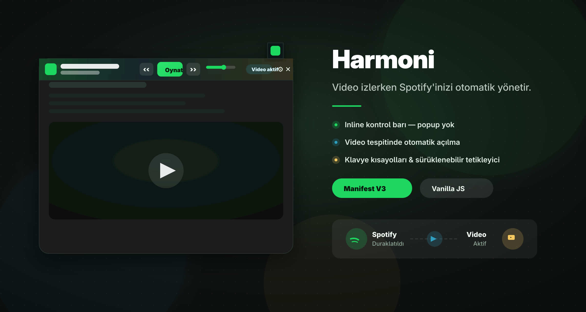
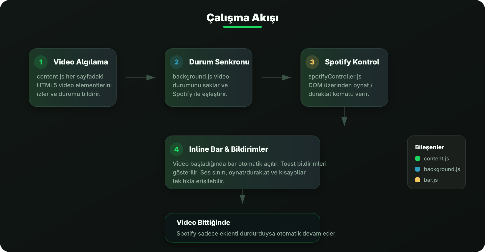

<p align="center">
  
</p>

<h1 align="center">Harmoni</h1>
<p align="center">
  <strong>Video izlerken Spotify müziğinizi otomatik yönetir.</strong>
</p>

<p align="center">
  
  
  
  
</p>

---

## Özellikler

- **🎛️ Inline Kontrol Barı** — Sayfanın en üstüne sabitlenen, `position: fixed` ile çalışan şık bir bar. Popup yerine doğrudan sayfa içinde çalışır.
- **▶️ Otomatik Senkronizasyon** — YouTube, Netflix, Twitch ve diğer tüm HTML5 video sitelerinde video başladığında Spotify duraklar, video durduğunda müzik devam eder.
- **🔔 Toast Bildirimleri** — Video başladığında/durduğunda ekranın altında şık bildirimler görünür.
- **📌 Sabitleme & Oto-Kapanış** — Bar'ı pin butonuyla sabitleyebilir veya 1-10 saniye arası ayarlanabilir süreyle otomatik kapanmasını sağlayabilirsiniz.
- **📹 Video Tespitinde Otomatik Açma** — Sayfada video algılandığında bar kendiliğinden belirir.
- **⌨️ Klavye Kısayolları** — Tüm kontrolleri klavyeden yapabilirsiniz.
- **🖱️ Sürüklenebilir Tetikleyici** — Köşedeki küçük ikonu mouse ile tutup istediğiniz yere bırakabilirsiniz. Konumu hatırlanır.
- **🔊 Anlık Ses Kontrolü** — Bar üzerinden Spotify ses sınırını slider ile ayarlayabilirsiniz.
- **📋 Playlist Yönetimi** — Varsayılan playlist URL'sini kaydedip tek tıkla yükleyebilirsiniz.

---

## Ekran Görüntüsü

<p align="center">
  
</p>

---

## Klavye Kısayolları

| Kısayol | Görev |
|:---|:---|
| `Ctrl + Shift + S` | Bar aç / kapat |
| `Ctrl + Shift + P` | Oynat / Duraklat |
| `Ctrl + Shift + N` | Sonraki parça |
| `Ctrl + Shift + B` | Önceki parça |

> 💡 **Bilgi:** Tüm kısayollar ve özellikler bar üzerindeki **? (Bilgi)** butonundan tek ekranda görülebilir.

---

## Kontrol Barı

Bar açıldığında sayfa içeriği otomatik olarak aşağı kaydırılır (`body.marginTop`), hiçbir şey gizlenmez.

### Ana Bar (44px)
| Bölüm | İçerik |
|:---|:---|
| **Sol** | Eklenti ikonu + çalan parça adı & sanatçı |
| **Orta** | Önceki `‹‹` / Oynat/Duraklat / Sonraki `››` + ses slider'ı (`+`/`-`) |
| **Sağ** | Video durum rozeti / Pin `📌` / Ayarlar `⚙` / Kapat `✕` |

### Ayarlar Toolbarı (⚙)
- **Kapanış süresi** — 1-10 saniye arası slider ile ayarlanabilir
- **Playlist URL** — Spotify playlist adresi
- **Video senkronu** — Video başlayınca Spotify duraklatma açık/kapalı
- **Spotify sekmesi** — Gerekirse otomatik sekmeyi hazırlama
- **Oto-kapanış** — Bar'ın belirli süre sonra kapanması
- **Video tespitinde aç** — Video algılandığında bar'ı otomatik açma

---

## Çalışma Akışı

<p align="center">
  
</p>

---

## Kurulum

1. Bu repoyu indir veya klonla:
   ```bash
   git clone https://github.com/zehedisode/spotify-automation-chrome-extension.git
   ```
2. Chrome'da `chrome://extensions` sayfasını aç.
3. Sağ üstten **Developer mode** seçeneğini aç.
4. **Load unpacked** butonuna bas.
5. Proje klasörünü seç.
6. Spotify Web'e giriş yap.
7. Herhangi bir sayfada eklenti ikonuna tıkla veya `Ctrl+Shift+S` ile bar'ı aç. Ayarları kaydet.

---

## Kullanım

1. Spotify Web'de müzik başlat.
2. YouTube, Netflix, X, Instagram, TikTok veya HTML5 video kullanan herhangi bir sitede video oynat.
3. Spotify otomatik duraklar.
4. Video durduğunda, bittiğinde veya sekme kapandığında Spotify kaldığı yerden devam eder.

Bar üzerinden Spotify Web'i açabilir, oynat/duraklat yapabilir, önceki/sonraki parçaya geçebilir, playlist'i arka planda yükleyebilir ve sesi anlık ayarlayabilirsin.

---

## Test Matrisi

| Senaryo | Beklenen Sonuç |
|:---|:---|
| Spotify çalarken YouTube videosu başlat | Spotify duraklar, bar otomatik açılır. |
| YouTube videosunu duraklat | Spotify yalnızca eklenti durdurduysa devam eder. |
| Video oynarken ikinci video sekmesi aç | Spotify duraklı kalır. |
| İki video sekmesinden birini kapat | Diğer video çalıyorsa Spotify başlamaz. |
| Son video sekmesini kapat | Spotify yalnızca eklenti durdurduysa devam eder. |
| Spotify'ı kullanıcı elle duraklatmışken video başlat | Video bitince Spotify otomatik başlamaz. |
| Spotify sekmesini kapat | Eklenti runtime durumunu temizler. |
| Video sekmesi yeniden yüklenir | Eski video kaydı temizlenir. |
| Chrome service worker uyur/uyanır | Son video heartbeat kaydı geçici ise geri yüklenir. |
| Bar üzerinden ses ayarı uygulanır | Spotify Web açıksa ses seviyesi güncellenir. |

---

## Proje Yapısı

```text
.
├── manifest.json          # MV3 manifest
├── background.js          # Service worker, video state sync
├── content.js             # Video detection in all pages
├── spotifyController.js   # Spotify Web DOM automation
├── bar.js                 # Inline fixed bar UI & controls
├── bar.css                # Isolated bar styles
├── icons/
│   ├── icon.svg
│   ├── icon16.png
│   ├── icon32.png
│   ├── icon48.png
│   └── icon128.png
└── docs/
    ├── readme-hero.svg    # Hero banner
    └── sync-flow.svg      # Architecture diagram
```

---

## Teknik Notlar

- **Manifest V3** service worker kullanır.
- Video algılama `content.js` ile tüm sayfalardaki HTML5 `video` elementleri üzerinden yapılır.
- Spotify kontrolü `chrome.scripting.executeScript` ile Spotify Web DOM kontrolleri üzerinden uygulanır.
- Ayarlar `chrome.storage.sync`, runtime durumları `chrome.storage.local` ve varsa `chrome.storage.session` ile saklanır.
- Inline bar `position: fixed` ile çalışır, scroll'dan etkilenmez.
- Bar açıldığında `document.body.style.marginTop` otomatik olarak bar yüksekliğine eşitlenir.

---

## Geliştirme

Kod değişikliklerinden sonra Chrome'da `chrome://extensions` sayfasına gidip eklentiyi yeniden yükle. Hızlı söz dizimi kontrolü için:

```bash
node --check background.js
node --check content.js
node --check bar.js
node --check spotifyController.js
```

---

## Lisans

Bu proje kişisel kullanım ve geliştirme için hazırlanmıştır.
