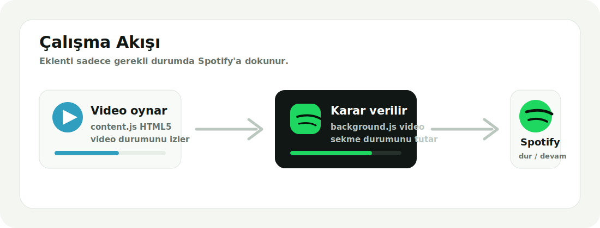

<p align="center">
  
</p>

# Spotify Video Sync

Chrome icin Manifest V3 tabanli Spotify Web otomasyon eklentisi. Bir sekmede video oynatildiginda Spotify Web'i otomatik duraklatir; video durdugunda veya sekme kapandiginda Spotify'i yalnizca eklenti durdurduysa devam ettirir.

<p>
  
  
  
</p>

## Neler Yapar?

- Spotify Web sekmesini otomatik bulur veya ayara gore acar.
- Herhangi bir sekmede HTML5 video oynatildiginda Spotify'i duraklatir.
- Birden fazla video sekmesi varsa Spotify'i ancak tum videolar durunca devam ettirir.
- Spotify kullanici tarafindan manuel durdurulduysa video bitince otomatik baslatmaz.
- Playlist URL'si, maksimum ses seviyesi ve otomasyon ayarlari popup'tan yonetilir.
- MV3 service worker uyku/uyanma davranisina karsi video durumunu kisa sureli saklar.
- Harici paket gerektirmez; direkt `Load unpacked` ile yuklenir.

## Calisma Akisi

<p align="center">
  
</p>

## Kurulum

1. Bu repoyu indir veya klonla.
2. Chrome'da `chrome://extensions` sayfasini ac.
3. Sag ustten `Developer mode` secenegini ac.
4. `Load unpacked` butonuna bas.
5. Bu proje klasorunu sec.
6. Spotify Web'e giris yap.
7. Eklenti popup'ini acip playlist URL'si, ses siniri ve otomasyon ayarlarini kaydet.

## Kullanim

1. Spotify Web'de muzik baslat.
2. YouTube, Netflix, X, Instagram, TikTok veya HTML5 video kullanan bir sitede video oynat.
3. Spotify otomatik duraklar.
4. Video durdugunda, bittiginde veya sekme kapandiginda Spotify kaldigi yerden devam eder.

Popup uzerinden Spotify Web'i acabilir, oynat/duraklat yapabilir, onceki/sonraki parcaya gecebilir, playlist'i arka planda yukleyebilir ve sesi anlik ayarlayabilirsin.

## Popup Kontrolleri

| Kontrol | Gorev |
| --- | --- |
| Spotify Web'i ac | Spotify sekmesini bulur, yoksa acar ve sekmeye gecer. |
| Oynat / Duraklat | Spotify Web oynatma durumunu degistirir. |
| Onceki / Sonraki | Spotify Web player kontrolunu kullanir. |
| Playlist yukle | Kayitli playlist URL'sini Spotify sekmesinde acar. |
| Ses siniri | Spotify sesini belirlenen seviyeye uygular. |
| Video senkronu | Video baslayinca Spotify duraklatma davranisini acar/kapatir. |
| Spotify sekmesi | Gerektiginde Spotify Web sekmesi olusturma davranisini acar/kapatir. |

## Test Matrisi

| Senaryo | Beklenen sonuc |
| --- | --- |
| Spotify calarken YouTube videosu baslat | Spotify duraklar. |
| YouTube videosunu duraklat | Spotify yalnizca eklenti durdurduysa devam eder. |
| Video oynarken ikinci video sekmesi ac | Spotify durakli kalir. |
| Iki video sekmesinden birini kapat | Diger video caliyorsa Spotify baslamaz. |
| Son video sekmesini kapat | Spotify yalnizca eklenti durdurduysa devam eder. |
| Spotify'i kullanici elle duraklatmisken video baslat | Video bitince Spotify otomatik baslamaz. |
| Spotify sekmesini kapat | Eklenti runtime durumunu temizler ve sessizce devam eder. |
| Video sekmesi yeniden yuklenir | Eski video kaydi temizlenir. |
| Chrome service worker uyur/uyanir | Son video heartbeat kaydi geciciyse geri yuklenir, eskiyse temizlenir. |
| Popup'tan ses ayari uygulanir | Spotify Web aciksa ses seviyesi guncellenir. |

> Video durum kayitlari 15 saniyeden eskiyse guvenlik icin gecersiz sayilir. Bu, Chrome'un Manifest V3 service worker uyku/uyanma davranisinda takili kalmis video kayitlarini temizlemek icindir.

## Proje Yapisi

```text
.
├── manifest.json
├── background.js
├── content.js
├── spotifyController.js
├── popup.html
├── popup.css
├── popup.js
├── icons/
│   ├── icon.svg
│   ├── icon16.png
│   ├── icon32.png
│   ├── icon48.png
│   └── icon128.png
└── docs/
    ├── readme-hero.svg
    └── sync-flow.svg
```

## Teknik Notlar

- Eklenti Manifest V3 service worker kullanir.
- Video algilama `content.js` ile tum sayfalardaki HTML5 `video` elementleri uzerinden yapilir.
- Spotify kontrolu `chrome.scripting.executeScript` ile Spotify Web DOM kontrolleri uzerinden uygulanir.
- Ayarlar `chrome.storage.sync`, runtime durumlari `chrome.storage.local` ve varsa `chrome.storage.session` ile saklanir.
- Spotify Web arayuzu degisirse DOM selector fallback'leri guncellenebilir.

## Gelistirme

Kod degisikliklerinden sonra Chrome'da `chrome://extensions` sayfasina gidip eklentiyi yeniden yukle. Hizli soz dizimi kontrolu icin:

```bash
node --check background.js
node --check content.js
node --check popup.js
node --check spotifyController.js
```

## Lisans

Bu proje kisisel kullanim ve gelistirme icin hazirlanmistir.
